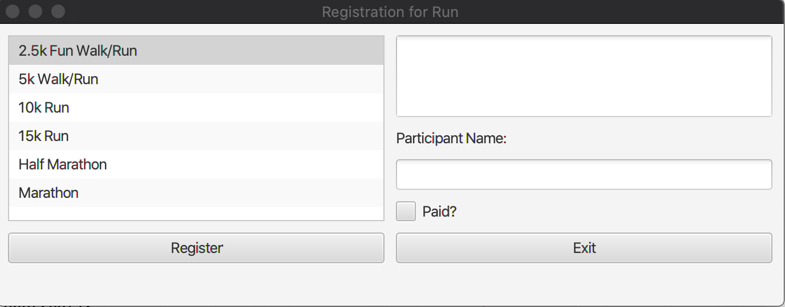
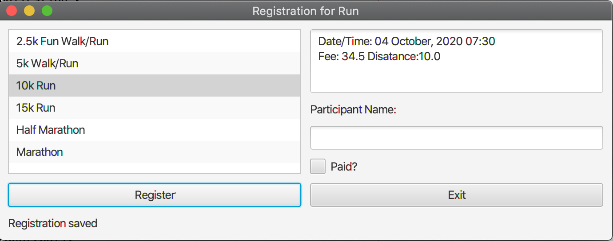

# Registration for Run

This program creates a GUI of an application that shows a list of available
events for races and a user to register and save their information into a text file.

A user can input information such as Name and Paid via text and checkbox. Once an event is selected information is displayed in text area 

Information is saved into a file once program is exited. 

